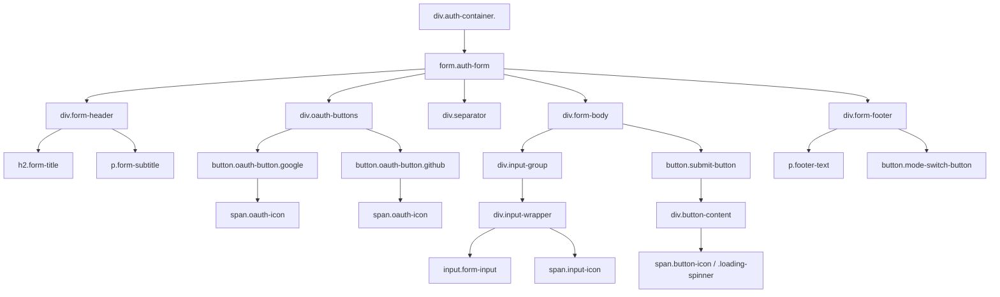

# Customizing and Contributing to AuthForm

This guide provides detailed instructions on how to customize the `AuthForm` component with your own CSS or contribute new design themes to the library.

## 1. Customizing the Design

You have complete control over the component's appearance. You can override existing styles, add new ones, or use a utility-first framework like Tailwind CSS.

### CSS Class Structure

To customize the component, you need to target the correct CSS classes. The component has a main container with a class that reflects the chosen `design` prop (e.g., `.modern`, `.minimal`, `.colorful`). All custom styles for a theme are scoped within this class.

Here is a diagram of the component's HTML structure and the most important classes:



### Key Classes for Customization

-   `div.auth-container`: The root container. All theme styles are scoped under `.auth-container.<design-name>`.
-   `form.auth-form`: The form element itself. This is a good place to control the form's background, padding, and shadows.
-   `h2.form-title` & `p.form-subtitle`: For styling the main header text.
-   `input.form-input`: The text fields for username, email, and password.
-   `span.input-icon`: The icons inside the input fields.
-   `button.submit-button`: The primary action button for submitting the form.
-   `button.oauth-button`: The buttons for social logins (e.g., Google, GitHub).
-   `div.separator`: The "or" separator between OAuth and email/password forms.
-   `p.error-message`: The text that appears when there's a validation error.

### How to Apply Custom Styles

1.  **Create a new CSS file** in your project (e.g., `custom-auth.css`).
2.  **Add your override styles.** Be specific with your selectors to ensure they take precedence. For example, to change the modern theme's button color:

    ```css
    /* custom-auth.css */
    .auth-container.modern .submit-button {
      background: linear-gradient(90deg, #00c9ff, #92fe9d);
      box-shadow: 0 10px 30px rgba(0, 201, 255, 0.4);
    }
    ```

3.  **Import the CSS file** in your main application file *after* the component's default CSS.

### Using Tailwind CSS

If you're using Tailwind, you can pass custom classes directly to the component via the `className` prop.

```jsx
import AuthForm from './components/AuthForm';

function MyPage() {
  return (
    <AuthForm
      design="modern"
      className="!bg-gray-900 border-t-4 border-teal-500" // Overrides background and adds a border
    />
  );
}
```

Note the use of `!` to mark the utilities as `!important`, which may be necessary to override the component's built-in styles.

## 2. Contributing a New Theme

We welcome contributions! If you've created a great new design, you can add it as a new theme to the library.

### Contribution Guidelines

1.  **Choose a Theme Name:** Pick a descriptive, one-word name for your theme (e.g., `vintage`, `corporate`, `neon`).

2.  **Add Your CSS:**
    *   Open `AuthForm.css`.
    *   Create a new section for your theme at the end of the file.
    *   Wrap all of your styles within the theme's root selector: `.auth-container.<your-theme-name>`. This is crucial to avoid conflicts with other themes.

3.  **Structure Your CSS:** Follow the existing structure. Create distinct styles for inputs, buttons, titles, etc., within your theme's scope. Make sure to style all states: `hover`, `focus`, `active`, and `disabled`.

    ```css
    /* Example structure for a new "neon" theme */

    /* ==========================================
       NEON THEME (Community Contribution)
       ========================================== */
    .auth-container.neon {
      /* Your base styles here */
      background-color: #0c0c0c;
      font-family: 'Your Chosen Font', sans-serif;
    }

    .auth-container.neon .auth-form {
      /* Form container styles */
    }

    .auth-container.neon .submit-button {
      /* Button styles */
    }

    /* ...and so on for all other elements ... */
    ```

4.  **Test Thoroughly:**
    *   Test both "signin" and "signup" modes.
    *   Check all input validation and error states.
    *   Ensure OAuth buttons are styled correctly.
    *   Verify that your design is responsive and looks good on mobile devices.

5.  **Submit a Pull Request:**
    *   Fork the repository.
    *   Create a new branch for your theme (`feature/neon-theme`).
    *   Commit your changes to `AuthForm.css`.
    *   Push to your fork and submit a pull request to the main repository.
    *   In your pull request description, include a screenshot of your new theme in action!

Thank you for helping make this component better! 